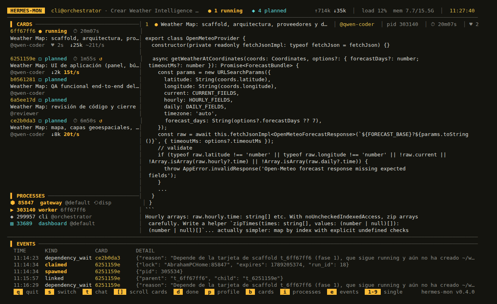

# hermes-mon

A live terminal monitor for [Hermes Agent](https://github.com/NousResearch/hermes-agent) kanban boards:
what every instance is doing, right now, in one screen.


Hermes can run a lot of work in parallel — an orchestrator that splits a job into cards, a pool of
coder profiles that implement them, a reviewer that checks them — and none of it is visible from the
terminal you launched it from. The board lives in SQLite, each worker writes its own log file, and the
dashboard's kanban tab shows one card's log at a time behind a manual refresh button.

`hermes-mon` puts the whole thing on one screen and keeps it moving.

## What it shows

- **Cards** grouped by state, newest first, with elapsed time, output tokens and tok/s.
- **Live worker logs**, auto-tailed, one pane per running card. Panes follow the work: a card finishes,
  its pane goes; another starts, its pane appears.
- **Hermes processes** alive on the machine — gateway, workers, CLI sessions — with their PID and profile.
- **Whether anyone is dispatching at all.** This is the reason the tool exists (see below).
- **Instances**: each session that ordered work, with the cards it created and its own conversation.

Everything is read-only. The board database is opened with `mode=ro`, worker logs are followed by
offset like `tail -f`, and process data comes from `/proc`. Nothing is ever written, so it cannot
interfere with the gateway or the dispatcher.

## The problem it was written for

A Hermes gateway decides **once, at startup**, whether it will run the kanban dispatcher. If it finds
the singleton lock held by another gateway, it gives up dispatching *for the rest of its life* and
never retries (`gateway/kanban_watchers.py`: `this gateway will NOT dispatch`).

So when the gateway holding the lock dies, nobody takes over. Cards sit in `ready` forever. There is no
error, no warning, nothing in the logs — the board simply stops, and you find out hours later.

`hermes-mon` reads `/proc/locks` to see who actually holds the dispatcher lock (without touching it —
grabbing it to test would cause the very race that breaks this) and says so in the header:

```
 HERMES-MON   board default   ● 0 running   ◆ 6 planned   ⚠ NO DISPATCHER
```

## Install

One file, no dependencies beyond the standard library:

```bash
curl -o ~/.local/bin/hermes-mon https://raw.githubusercontent.com/abrahammg/hermes-monitor/main/hermes-mon
chmod +x ~/.local/bin/hermes-mon
```

Requires Python 3.10+ and Linux (`/proc`).

## Usage

```bash
hermes-mon                  # the active board
hermes-mon --pick           # choose what to watch first
hermes-mon --profile qwen-coder
hermes-mon --snapshot       # one frame as plain text, for pipes and scripts
```

| key | |
|---|---|
| `s` | switch instance / board |
| `t` | inside an instance: its work ⇄ its conversation |
| `d` | show/hide finished cards |
| `p` | cycle the profile filter |
| `b` | show/hide the card sidebar |
| `i` | show/hide the process panel |
| `e` | show/hide the event feed |
| `[` `]` | scroll the sidebar |
| `1`-`9` | one worker full screen · `0` all |
| `↑↓ PgUp PgDn` | scroll the focused log (pauses follow) |
| `q` | quit |

## Views

### Instance switcher (`s`)

Each session that ordered work is an instance: the conversation plus the cards it created
(`tasks.session_id` records the author). Switching replaces the whole screen, so two Hermes never
bleed into each other's view.


### One instance

Only its cards, only its workers, only its events.



### Its conversation (`t`)

A CLI/TUI session writes no log file — its only trace is the `messages` table of its profile. That is
how an instance that never touches kanban can still be watched.


## Notes on the numbers

- **tok/s while running** is a rolling 60-second average. Token counters only advance when an API call
  closes, so between calls the window reads zero even though text is streaming; in that case the
  monitor falls back to the average since the card started and marks it with `~`.
- **A finished card** is credited to the run that actually delivered it, not to its wall-clock. A card
  that was reclaimed, retried, or crash-looped shows the delivering run's time and rate, with `+N` for
  the earlier attempts. `↺` marks a run that ended without delivering.
- **Tokens are summed across every attempt** of a card, including ones under a different profile.
- **`↑` input tokens are cumulative per call** — every call resends the context — so that number grows
  far faster than the output one. It is not how much unique text was sent.

## Options

```
--board SLUG        board to watch (default: the active one)
--profile NAME      only cards owned by this profile
--interval SECONDS  refresh period (default 1.0)
--events            start with the event feed open
--processes         start with the process panel open
--no-done           hide finished cards
--archived          include archived cards
--no-tokens         do not read the profiles' state.db
--no-instances      do not scan /proc at all
--no-color          monochrome (NO_COLOR is honoured too)
--pick / --no-pick  force or skip the startup picker
--snapshot          print one frame as plain text and exit
```

## License

MIT.
