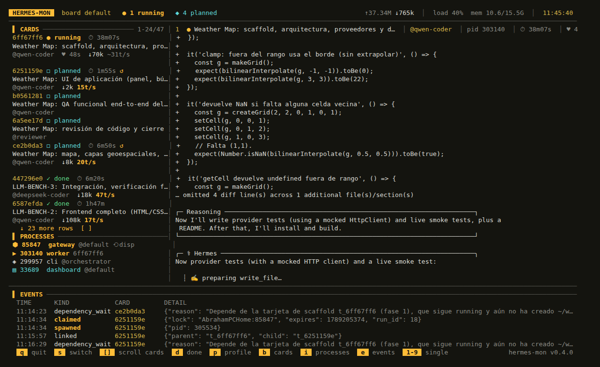
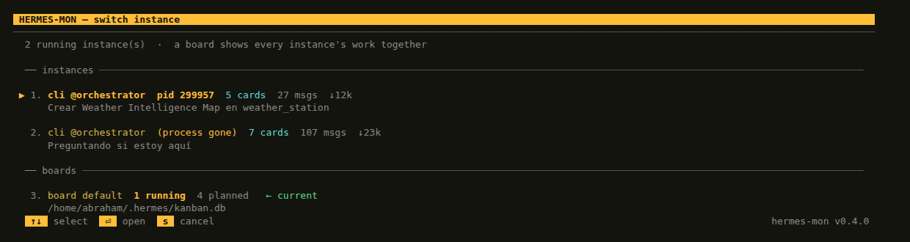
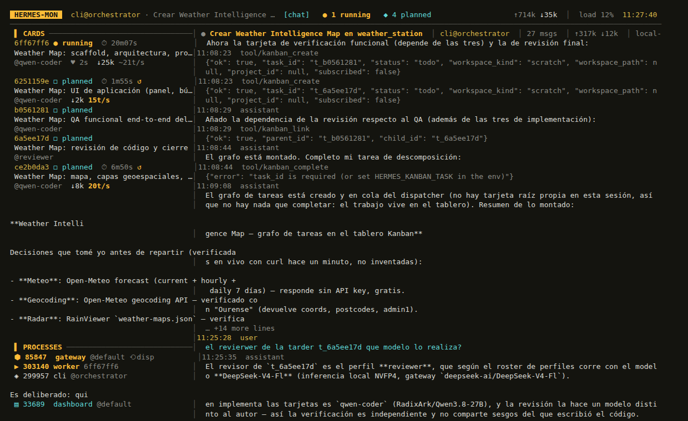

# Hermes multiagente en local: qué compensa y qué no

*Informe de un fin de semana midiendo un montaje de orquestador + coders + revisor sobre modelos
autoalojados. Septiembre de 2026.*

---

## Resumen

Monté Hermes Agent con cinco perfiles (un orquestador que trocea el trabajo, dos coders, un revisor y
un analista visual), cada uno servido por un modelo distinto en una Spark propia, y le pedí dos
proyectos completos: una recreativa vectorial de siete juegos y un mapa meteorológico. Lo que sigue
son los números que salieron, las trampas con las que me encontré y cómo montarlo si queréis probarlo.

**Lo que compensa:**

- El reparto en cards funciona de verdad: siete cards, tres o cuatro corriendo en paralelo, cada una
  con su propio contexto y su propio modelo. No es una demo, entrega código.
- Los modelos no son intercambiables. En tareas de código, **DeepSeek V4 Flash entregó donde Qwen y GLM
  ni siquiera llegaron a escribir**, y a 2-3× de velocidad.
- Bajar la temperatura de Qwen de 1.0 a 0.6 redujo la verborrea **4×** (2.300 → 579 tokens por llamada).

**Lo que no compensa, o duele:**

- Hay un fallo de diseño en el dispatcher que puede dejarte el tablero parado horas sin un solo error
  en los logs. Me pasó: hora y media perdida.
- El 70% de todo lo que generan estos modelos es razonamiento interno, no código.
- Sin herramientas de observación propias vas ciego: la consola no enseña nada y el dashboard enseña
  una card cada vez.

---

## 1. El montaje

| perfil | modelo | endpoint | temp | papel |
|---|---|---|---|---|
| `orchestrator` | GLM-5.3-Flash-NVFP4 | Spark 80 | 0.4 | Trocea, enruta, verifica. No toca ficheros |
| `qwen-coder` | Qwen3.8-27B-NVFP4 | Spark 31 | 0.6 | Coder principal |
| `deepseek-coder` | DeepSeek-V4-Flash | Spark 34 | 0.3 | Segundo coder / segunda opinión |
| `reviewer` | DeepSeek-V4-Flash | Spark 34 | 0.1 | Revisión independiente, sin editar |
| `vision` | Gemma-4-31B-IT | Spark 79 | 0.3 | Capturas y diagramas → hallazgos escritos |

Cada perfil es un proceso Hermes independiente con su modelo, su sampling y sus toolsets. El revisor
usa **un modelo distinto al que escribió el código** a propósito: que el autor no se revise a sí mismo.

---

## 2. Cómo funciona

### El tablero

El trabajo vive en un kanban SQLite (`~/.hermes/kanban.db`) compartido por todos los perfiles. Una card
pasa por `triage → todo → ready → running → review → done`. El orquestador crea las cards; el
*dispatcher* las reparte; cada card se ejecuta en un proceso Hermes aparte con el perfil de su
`assignee`, en su propio workspace.

Dos comportamientos que me sorprendieron para bien:

**Las cards se auto-organizan.** Dos cards de Weather Map arrancaron, vieron que el scaffold del que
dependían no existía todavía, **se declararon hijas de esa card y volvieron a la cola**:

```
11:07:33 claimed          → corre 6m50s
11:14:07 linked           {"parent":"t_6ff67ff6","child":"t_ce2b0da3"}
11:14:23 dependency_wait  "Depende de la card de scaffold (fase 1), que sigue running…"
```

No cuenta como fallo (`consecutive_failures = 0`); cuando la madre termine, el dispatcher las promueve
solas. El coste de esa vuelta fueron 10k tokens.

**El review se encadena solo** si activas `review_dispatch`: al completar una card de implementación se
genera su card de revisión para el perfil revisor.

### El dispatcher, y la trampa

El dispatcher **vive dentro del gateway** y solo puede haber uno. Se coordinan con un cerrojo
(`~/.hermes/kanban/.dispatcher.lock`). La regla, en `gateway/kanban_watchers.py`:

> cuando un gateway arranca, intenta coger el cerrojo. Si lo encuentra ocupado, **renuncia a despachar
> durante el resto de su vida** y no lo reintenta jamás.

Esto me costó hora y media. La secuencia:

```
20:27  arranca la máquina
20:29  hermes update
20:32  systemd arranca hermes-gateway (servicio de sistema, perfil default)
20:33  ese gateway ve el cerrojo ocupado por el gateway viejo que se está apagando → RENUNCIA
20:33  el gateway viejo termina de apagarse y suelta el cerrojo
20:58  abro una sesión en otro perfil → su gateway coge el cerrojo → despacha la primera card
~22h   ese gateway de sesión muere (era primer plano, atado a la terminal)
22:42  la card termina y promueve otras cinco a ready
22:42→00:12   nadie despacha. Sin error, sin aviso. Hora y media parado.
```

El diagnóstico propio de Hermes (`hermes kanban diagnostics`) sí lo detecta —`stranded_in_ready`— pero
solo si lo ejecutas tú.

**Cómo evitarlo:** que despache siempre el mismo gateway, el del servicio de sistema, y que ningún otro
pueda robarle el cerrojo:

```yaml
# ~/.hermes/config.yaml  (perfil default, el del servicio)
kanban:
  dispatch_in_gateway: true

# ~/.hermes/profiles/<cada-otro-perfil>/config.yaml
kanban:
  dispatch_in_gateway: false
```

Sin carrera no hay carrera que perder. Y si el servicio se reinicia tras una actualización, coge el
cerrojo porque nadie más lo toca.

---

## 3. Rendimiento de los modelos

### 3.1 Banco sintético

Misma petición, `temperature 0.6`, `top_p 0.95`, sin streaming. Dos tareas: una de chat y una de
código (casco convexo, algoritmo de Andrew, con comentarios y ejemplo de uso).

| modelo | tarea | tokens | seg | tok/s | texto entregado | razonamiento | ¿terminó? |
|---|---|---|---|---|---|---|---|
| GLM-5.3-Flash | chat | 384 | 11,8 | 32,7 | 344 car. | 1.779 car. | sí |
| Qwen3.8-27B | chat | 146 | 4,9 | 29,7 | 285 car. | 534 car. | sí |
| DeepSeek-V4-Flash | chat | 243 | 4,7 | 51,5 | 352 car. | 878 car. | sí |
| GLM-5.3-Flash | **código** | 4.000 | 111,4 | 35,9 | **0 car.** | 13.033 car. | **no** (tope) |
| Qwen3.8-27B | **código** | 4.000 | 116,3 | 34,4 | **0 car.** | 11.319 car. | **no** (tope) |
| DeepSeek-V4-Flash | **código** | 956 | 14,8 | 64,6 | 2.365 car. | 1.052 car. | **sí** |

Esto confirma la intuición de partida y la lleva más lejos. **En chat los tres son comparables**: la
diferencia de velocidad (50 vs 30 tok/s) se compensa porque Qwen genera menos tokens, y el usuario
percibe tiempos parecidos.

**En código la diferencia es categórica.** Con 4.000 tokens de presupuesto, DeepSeek entregó una
función completa con ejemplo de uso en 956 tokens y 15 segundos. GLM y Qwen agotaron los 4.000 tokens
**razonando** y no llegaron a escribir ni un carácter de código. Con más presupuesto habrían terminado
—en las cards reales terminan— pero eso son dos minutos de reloj antes de la primera línea útil.

### 3.2 A igualdad de carga

Objeción obligada: las Sparks no estaban igual de ocupadas. Repetí con **dos peticiones en vuelo en
cada una**:

| | 1 petición | 2 peticiones |
|---|---|---|
| Qwen3.8-27B | — (nunca estuvo ociosa) | **23,7 tok/s** |
| DeepSeek V4 Flash | 55,2 tok/s | **45,1 / 42,6 tok/s** |

Y por otro camino: la card VA-1 corrió **sola** en la Spark de Qwen y dio 22,9 tok/s. Los dos métodos
coinciden en ~23 tok/s para Qwen frente a 43-55 de DeepSeek. **El reparto explica parte de la
diferencia, pero no toda: queda un factor ~2 de modelo.**

### 3.3 Datos reales: siete cards de un proyecto

Tiempo del intento que entregó, no el reloj de pared de la card:

| card | perfil | duración | tokens salida | llamadas | tok/s |
|---|---|---|---|---|---|
| VA-1 Motor + portal | qwen-coder | 103,8 m | 142.401 | 57 | 22,9 |
| VA-2 MINE STORM | qwen-coder | 114,8 m | 115.508 | 59 | 16,8 |
| **VA-3 RIP-OFF** | **deepseek-coder** | **12,2 m** | 35.150 | 28 | **47,8** |
| VA-4 ARMOR ATTACK | qwen-coder | 33,5 m | 37.830 | 28 | 18,8 |
| VA-5 CLEAN SWEEP | qwen-coder | 92,5 m | 90.780 | 22 | 16,4 |
| VA-6 STAR CASTLE | qwen-coder | 76,5 m | 72.826 | 46 | 15,9 |
| VA-7 Integración | qwen-coder | 16,6 m | 21.077 | 37 | 21,2 |

VA-3 y VA-4 son la comparación limpia: **mismo tipo de juego, las mismas 28 llamadas, volumen de salida
casi idéntico** (35k vs 38k). DeepSeek: 12 minutos. Qwen: 33.

### 3.4 ¿Razona más Qwen? No

Medí la partición de lo generado en las dos cards gemelas:

| | VA-3 (DeepSeek) | VA-4 (Qwen) |
|---|---|---|
| Razonamiento | 138.724 car. — **73,9%** | 120.526 car. — **68,5%** |
| Texto de respuesta | 3.742 — 2,0% | 2.569 — 1,5% |
| Llamadas a herramientas (el código) | 45.196 — 24,1% | 52.941 — **30,1%** |

**El que más razona es el rápido.** La hipótesis intuitiva —"Qwen va lento porque piensa demasiado"— no
se sostiene: los dos piensan casi lo mismo, y Qwen incluso entrega más código. La diferencia de 33 a 12
minutos es velocidad de generación.

Aviso para quien mire los contadores: `sessions.reasoning_tokens` marcaba **19.596 para Qwen y 0 para
DeepSeek**, porque el endpoint de DeepSeek no desglosa el razonamiento en el `usage`. Si te fías de esa
columna sacas la conclusión contraria a la real. Hay que contar los caracteres de los campos de
razonamiento de cada mensaje.

### 3.5 El experimento de la temperatura

Qwen venía con `temperature: 1.0`, que es el valor recomendado para su modo **sin** thinking; con
thinking activado, Qwen recomienda 0.6. Lo bajé y comparé la métrica que no depende de la concurrencia
—cuánto escribe por llamada:

| | cards | tokens por llamada |
|---|---|---|
| temperatura 1.0 | VA-1, VA-2, VA-4, VA-5, VA-6 | **2.303** de media |
| temperatura 0.6 | VA-7, LLM-BENCH-1, LLM-BENCH-2, Weather | **579** de media |

**Cuatro veces menos texto por llamada.** Con los mismos toolsets y el mismo thinking. Los tiempos por
card también bajaron (VA-7 en 16,6 m; LLM-BENCH-1 en 22,1 m, frente a los 33-115 m de las cards con
temperatura 1.0), aunque ahí influyen el tipo de tarea y la concurrencia, así que lo doy como
indicio fuerte, no como prueba cerrada.

Es el cambio con mejor relación esfuerzo/resultado de todo el fin de semana: una línea de configuración.

### 3.6 Un detalle de infraestructura que importa

Las métricas de vLLM explican por qué la concurrencia no hunde el servidor tanto como parece:

```
prefix cache      : 221.140.176 aciertos / 282.372.443 consultados = 78,3% reutilizado
kv_cache_usage    : 10-29%
num_preemptions   : 0
tiempo al 1er tok : ~5 s   (prompt medio de 11.334 tokens)
```

Cada llamada reenvía el contexto entero —de ahí que los contadores de entrada marquen millones— pero
**cuatro de cada cinco tokens no se recalculan**: salen de la caché de prefijo. Con 5 workers a la vez
no hubo ni un desalojo. Lo que sí se reparte es la velocidad: 5 workers → ~13 tok/s cada uno; 2
workers → 42 tok/s uno de ellos.

---

## 4. Conclusiones prácticas

1. **Elegid el modelo por tarea, no por benchmark general.** Para chat, cualquiera de los tres. Para
   código agéntico, DeepSeek V4 Flash fue entre 2× y 3× más rápido en reloj de pared, con la misma
   economía de tokens.
2. **Bajad la temperatura a la recomendada del modelo en modo thinking.** 4× menos verborrea en Qwen.
3. **Limitad la concurrencia por perfil.** Con `max_in_progress_per_profile: 2` cada worker va a ~40
   tok/s en vez de ~13. El trabajo total tarda parecido, pero la interactividad cambia por completo.
4. **Vigilad el dispatcher.** Es el único fallo que he visto capaz de perder horas en silencio.
5. **Contad tokens de salida, no de entrada.** La entrada es acumulada por llamada y engaña: 6,9
   millones "subidos" eran 149 llamadas reenviando un contexto de 45-70k.

---

## 5. Cómo montarlo

### 5.1 Un perfil por papel

```bash
hermes profile create orchestrator
hermes profile create qwen-coder
hermes profile create deepseek-coder
hermes profile create reviewer
```

Cada uno con su `~/.hermes/profiles/<nombre>/config.yaml`. El coder:

```yaml
model:
  default: RadixArk/Qwen3.8-27B-NVFP4
  provider: custom:spark31
  base_url: http://IP:8000/v1
  api_key: ollama
  api_mode: chat_completions
  context_length: 262144
providers:
  spark31:
    name: Spark 31
    base_url: http://IP:8000/v1
    api_key: ollama
    api_mode: chat_completions
    default_model: RadixArk/Qwen3.8-27B-NVFP4
    context_length: 262144
    models:
      RadixArk/Qwen3.8-27B-NVFP4: {}
    extra_body:              # el sampling recomendado del modelo, no el de serie
      temperature: 0.6
      top_p: 0.95
      top_k: 20
      chat_template_kwargs:
        enable_thinking: true
agent:
  reasoning_effort: medium
toolsets: [terminal, file, code_execution, web, browser, skills, todo, memory, session_search, clarify]
kanban:
  dispatch_in_gateway: false   # solo el servicio despacha
```

El orquestador es igual pero **sin toolsets de escritura** —`[kanban, memory, todo, session_search,
clarify]`— para que no implemente él. El revisor, igual que el coder pero con `temperature: 0.1`, sin
`browser` y sin permiso de edición.

> **`reasoning_effort` no llega a un endpoint openai-compatible.** Lo comprobé en
> `agent/transports/chat_completions.py`: solo se envía para Kimi, TokenHub y LM Studio. Lo que sí
> llega es `chat_template_kwargs.enable_thinking`.

### 5.2 El kanban, en el perfil del servicio

```yaml
# ~/.hermes/config.yaml
kanban:
  dispatch_in_gateway: true
  dispatch_interval_seconds: 60
  orchestrator_profile: orchestrator
  default_assignee: qwen-coder
  max_in_progress: 4               # tope global
  max_in_progress_per_profile: 2   # tope por modelo: esto es lo que protege cada Spark
  review_dispatch: true            # encadena la card de revisión al completar
  auto_decompose: true
  failure_limit: 2
```

### 5.3 El gateway, como servicio

```bash
hermes gateway install --start-now --start-on-login
loginctl enable-linger $USER     # para que arranque sin iniciar sesión
```

Y `dispatch_in_gateway: false` en **todos** los demás perfiles (§2). Sin eso, cualquier sesión que
abras puede quedarse el cerrojo y dejarte el tablero muerto al cerrarla.

### 5.4 Lanzar trabajo

Le hablas al orquestador en lenguaje natural —"haz una recreativa vectorial con siete juegos, un
archivo por juego, contrato en docs/CONTRACT.md"— y él crea las cards. A partir de ahí el dispatcher
las reparte solo. Comprobar el estado:

```bash
hermes kanban list
hermes kanban diagnostics     # stranded_in_ready y otros síntomas
hermes kanban log <card_id>   # el log del worker
```

---

## 6. El monitor

Nada de lo anterior es visible desde la terminal, así que escribí uno:
**[github.com/abrahammg/hermes-monitor](https://github.com/abrahammg/hermes-monitor)** — un fichero
Python, sin dependencias, solo lectura.



Cards por estado con su tiempo y sus tok/s, los logs de los workers vivos en auto-tail, los procesos
Hermes de la máquina y el aviso de si **hay alguien despachando** —el fallo de §2 se detecta leyendo
`/proc/locks`, sin tocar el cerrojo.

Cada sesión que encargó trabajo es una "instancia": su conversación más las cards que creó
(`tasks.session_id` guarda el autor). Se alterna entre ellas y cada una se ve por separado:



Dentro de una instancia, `t` alterna entre su trabajo y su conversación — así también se ve un Hermes
que no usa kanban, que no escribe ningún log y solo existe en la tabla `messages` de su perfil.



---

## 7. Anexo: lo mismo en opencode

Para quien use opencode en vez de Hermes, el equivalente es un `opencode.jsonc` con un agente primario
que solo delega y subagentes con permisos recortados:

```jsonc
{
  "provider": {
    "spark31": { "npm": "@ai-sdk/openai-compatible", "name": "Qwen on Spark 31",
      "options": { "baseURL": "http://IP:8000/v1", "apiKey": "ollama" },
      "models": { "RadixArk/Qwen3.8-27B-NVFP4": {
        "limit": { "context": 262144, "output": 32768 },
        "options": { "top_p": 0.95, "top_k": 20,
                     "chat_template_kwargs": { "enable_thinking": true } } } } }
  },
  "model": "spark80/local-inference-lab/GLM-5.3-Flash-NVFP4-Spark",
  "default_agent": "orchestrator",
  "agent": {
    "build":   { "disable": true },
    "general": { "disable": true },
    "orchestrator": {
      "mode": "primary", "temperature": 0.4,
      "model": "spark80/local-inference-lab/GLM-5.3-Flash-NVFP4-Spark",
      "prompt": "{file:./prompt/orchestrator.md}",
      "permission": { "edit": "deny", "bash": "deny",
                      "task": { "*": "deny", "qwen-coder": "allow", "reviewer": "allow" } }
    },
    "qwen-coder": {
      "mode": "subagent", "temperature": 0.6,
      "model": "spark31/RadixArk/Qwen3.8-27B-NVFP4",
      "permission": { "edit": "allow", "task": "deny",
                      "bash": { "*": "allow", "git push*": "deny", "rm -rf *": "deny" } }
    },
    "reviewer": {
      "mode": "subagent", "temperature": 0.1,
      "model": "spark34/deepseek-ai/DeepSeek-V4-Flash-0731",
      "permission": { "edit": "deny", "task": "deny",
                      "bash": { "*": "deny", "git diff*": "allow", "pytest*": "allow" } }
    }
  }
}
```

**Diferencias que importan.** opencode paraleliza de verdad —lo verifiqué: dos subagentes atacando dos
endpoints a la vez— pero sus subagentes son **hijos de tu sesión**: si cierras la TUI, mueren. No hay
cola persistente, ni reintentos, ni dependencias entre tareas. El kanban de Hermes sobrevive al cierre
del terminal y se recupera solo; es la razón para preferirlo en lotes largos. Para trabajo interactivo
delante de la pantalla, opencode va sobrado y se ve todo sin herramientas extra.

Ojo también con `top_k`, `min_p` y `enable_thinking`: en opencode no caben en la config del agente
(solo `temperature` y `top_p`), hay que meterlos en las `options` del modelo, que viajan en el cuerpo
de la petición. Verificado poniendo un `top_k: -5` a propósito y viendo al vLLM rechazarlo.

---

## 8. Pendiente para la próxima

- **Medir Qwen con la Spark realmente ociosa.** Todas mis medidas de Qwen tienen al menos una card
  trabajando al lado; el 23 tok/s es un suelo, no su techo.
- **Probar `enable_thinking: false` en cards mecánicas.** Si el 70% de lo generado es razonamiento,
  ahí hay un 3× potencial en tareas donde el contrato ya está escrito y no hay que diseñar nada.
- **DeepSeek como coder principal** unos días, con Qwen de segundo, y comparar la misma clase de card.
- **Revisar el coste de las dependencias descubiertas tarde.** 10k tokens en dos cards que arrancaron
  antes de tiempo; probablemente se evita declarando las dependencias al crear las cards.
- **Medir al revisor.** Todavía no tengo datos de cuánto aporta el review encadenado frente a su coste.
- **Mejoras del monitor**: histórico por card (todas sus tentativas), export a CSV de las métricas para
  hacer estas tablas sin scripts sueltos, y un aviso cuando una card lleva demasiado tiempo sin
  heartbeat.

---

*Todos los números de este informe salen de la `kanban.db`, de las `state.db` de cada perfil y de las
métricas Prometheus de los vLLM. Los scripts de medición y el monitor están en el repositorio.*
